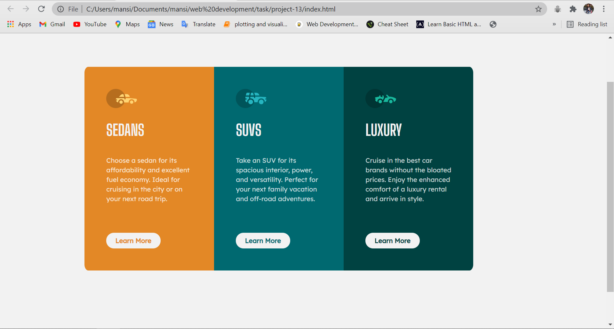

# Frontend Mentor - 3-column preview card component solution

This is a solution to the [3-column preview card component challenge on Frontend Mentor](https://www.frontendmentor.io/challenges/3column-preview-card-component-pH92eAR2-). 
Frontend Mentor challenges help you improve your coding skills by building realistic projects. 

## Table of contents

- [Overview](#overview)
- [The challenge](#the-challenge)
- [Screenshot](#screenshot)
- [Links](#links)
- [My process](#my-process)
- [Built with](#built-with)
- [What I learned](#what-i-learned)
- [Continued development](#continued-development)
- [Useful resources](#useful-resources)
- [Author](#author)

## Overview
Completed challenge using bootstrap.

### The challenge

Users should be able to:

- View the optimal layout depending on their device's screen size

### Screenshot

### Links

- Solution URL: [https://github.com/mansi05041/3_column_preview_card_component.github.io]
- Live Site URL: [https://3-column-preview-card-component-github-io.vercel.app/]

## My process

I use bootstrap for responsive part & column allignment & breakpoint.

### Built with

- Semantic HTML5 markup
- CSS custom properties
- Mobile-first workflow
- Bootstrap

### What I learned

It is an easy task .

### Continued development

Still need improvement with allignment in desktop view  & responsive part .

### Useful resources

- [Bootstrap](https://getbootstrap.com/) - This helped me in columns breakpoint & grid.
- [CSS button generator](https://css3buttongenerator.com/) - This help in animation & structure of button.

## Author

- Frontend Mentor - [@mansi05041](https://www.frontendmentor.io/profile/mansi05041)
- Linkedin - [mansi joshi](https://www.linkedin.com/in/mansi-joshi-663aa81a0/)

